# hvec

**A Rust sandbox for homomorphic compression of embedding vectors, aimed at vector databases.**

Blog and experiment write-ups: [swinecoder101.github.io/hvec](https://swinecoder101.github.io/hvec/)

<p align="center">
  
</p>

> Status: early experimental. Milestone 1 (interactive shell and CLI, model connectors, f32 baseline
> store, run log) is in place. Compression codecs and the benchmark matrix are next. Expect APIs and results to change
> without notice. Contributions and experiments are welcome; see [CONTRIBUTING.md](CONTRIBUTING.md).

## What is homomorphic compression?

A compression scheme is *homomorphic* with respect to an operation when you can perform that
operation directly on the compressed representation and get the same (or a controlled
approximation of the same) result you would get on the original data. You never have to
decompress.

For vector search the operations that matter are:

- inner product and cosine similarity,
- Euclidean (L2) distance,
- top-k nearest-neighbour selection built on the two above.

If a codec preserves these operations, a vector database can store compressed vectors, scan them
compressed, and rank them compressed. That cuts memory, bandwidth, and cache pressure at the
hottest part of the query path.

Familiar techniques already sit on this spectrum, even if they are rarely named this way:

| Technique | Compressed-domain op | Trade-off |
|---|---|---|
| Scalar / int8 quantization | Approximate dot product | Small loss, ~4x smaller |
| Binary / 1-bit quantization | Hamming distance as a proxy | Large loss, ~32x smaller |
| Product quantization (PQ) with asymmetric distance | Table-lookup distance | Tunable loss, 8-64x smaller |
| Random projections / JL sketches | Approximate inner product | Provable error bounds |
| Homomorphic encryption (CKKS and friends) | Exact ops on ciphertext | Privacy, heavy compute |

hvec is a place to implement these side by side in Rust, measure them honestly, and explore the
gaps between them. It does this with a CLI that runs a real retrieval-augmented generation (RAG)
pipeline end to end: ingest documents, store their embeddings through a codec, retrieve in the
compressed domain, ask a chat model, and record every stage's cost and outcome. The question hvec
exists to answer is not "what is recall@10" but "does this compression change the answers a given
model gives, and by how much".

## Goals

- **Implement** a family of compressed-domain similarity codecs behind a shared trait.
- **Measure** recall, distance error, throughput, and memory, and then the thing that matters:
  end-to-end answer quality per chat model, with reproducible runs.
- **Explore** the boundary between lossy compression and privacy-preserving computation. The
  encryption side (computing similarity on encrypted vectors) is in scope as an experiment track.
- **Stay small.** This is a research sandbox, not a database. Results should be easy to lift
  into real systems.

## Non-goals

- Building a full vector database, indexing service, or network API.
- Production hardening or stability guarantees.
- Competing with mature libraries on raw speed before the ideas are proven.

## Layout

```
hvec/
├── crates/
│   ├── hvec-core/      # Codec trait, Metric, distance kernels, f32 baseline codec
│   ├── hvec-connect/   # ChatModel + Embedder traits; Anthropic, OpenAI-compatible, local ONNX
│   ├── hvec-store/     # SQLite: collections, compressed-domain search, sessions, run log
│   ├── hvec-bench/     # Chunking, fixed RAG prompt, metrics, typed run records
│   └── hvec/           # The CLI
├── experiments/        # One directory per experiment with its write-up
├── CONTRIBUTING.md
└── README.md
```

The benchmark is a matrix: **embedding model × codec × chat model × dataset**. Compression
behaviour depends on the embedding model (dimension, distribution, normalisation). Tolerance to
degraded retrieval depends on the chat model. hvec keeps both axes explicit in every run record.

## Getting started

You need a stable Rust toolchain (1.85 or newer). Install it with [rustup](https://rustup.rs).

```sh
git clone https://github.com/SwineCoder101/hvec.git
cd hvec
cargo build --release
cargo test
```

The binary is at `target/release/hvec`. Put it on your `PATH` or run it as `cargo run --release --`.
Then type `hvec`. With no subcommand it writes a starter config if needed and opens an interactive
session. The sections below describe that shell and the scriptable subcommands behind it.

The default build includes the local embedding backend, which pulls in ONNX Runtime. If you only
want remote embedders, build with `cargo build --release --no-default-features`. See
[Troubleshooting](#troubleshooting) for the macOS SDK requirement.

## How to use the CLI

### The interactive shell

```sh
export ANTHROPIC_API_KEY=sk-ant-...
hvec
```

```
hvec 0.1.0 | config ~/.config/hvec/config.toml | db ~/.local/share/hvec/hvec.db
session    20261008-161918 (0 messages)
collection none (plain chat, no retrieval; use /use <collection>)
chat       anthropic (claude-opus-5-5) | k=5 | show-context=false
Type a question, or /help for commands. Ctrl-D or /quit to exit.

hvec> /new handbook docs/
ingested 212 chunks from 31 files into `handbook` in 4.1s (384 dims, codec f32, 212 chunks total)
hvec[handbook]> What is our refund policy?
...
[claude-opus-5-5 | f32 | k=5 | embed 8ms, retrieve 1ms, generate 2310ms | 1480 in / 212 out tokens | recorded]
```

Plain text is a question. If a collection is selected the shell retrieves passages first and
records the turn in the run log; without one it is plain chat and nothing is recorded. Every
launch creates a new timestamped session unless you pass `-s <name>`, and the transcript is saved
so `hvec -s <name>` resumes it. If exactly one collection exists it is selected automatically.

| Command | Effect |
|---|---|
| `/use <name>`, `/use none` | Select a collection, or turn retrieval off |
| `/new <name> <paths...>` | Create a collection by ingesting files or directories |
| `/ingest <paths...>` | Add files to the current collection |
| `/model [name]` | List chat profiles, or switch to one for the next turn |
| `/session <name>` | Switch to or create a session |
| `/k <n>` | Passages to retrieve per turn |
| `/context` | Toggle printing the retrieved passages |
| `/status`, `/collections`, `/sessions`, `/runs [n]`, `/embedders` | Inspect state |
| `/quit` | Exit. Ctrl-D works too |

Switching models inside one session is the point: ask the same question under `/model anthropic`
and `/model ollama` and both turns land in the run log with the same session name and collection.

Flags: `hvec -s <session> -c <collection> --chat <profile> -k <n>`. `hvec chat` is an alias.

### Scriptable subcommands

Everything the shell does is also a subcommand, for scripts and benchmarks.

### 1. Create a config

```sh
hvec config init
hvec config path      # where it was written
hvec config show      # resolved values, including the database path
```

The starter config defines several profiles. The defaults are Claude Opus 5.5 for chat and a local
`bge-small-en-v1.5` model for embeddings, so the only secret you need is:

```sh
export ANTHROPIC_API_KEY=sk-ant-...
```

Other profiles in the starter file cover OpenAI, a local Ollama server, and OpenAI-compatible
embeddings. Edit the file, or add your own `[chat.<name>]` and `[embed.<name>]` tables. Any server
that speaks the OpenAI `/chat/completions` or `/embeddings` protocol works with `provider = "openai"`.
Set `HVEC_CONFIG` or pass `--config` to use a different file.

### 2. Ingest documents

```sh
hvec ingest docs/ notes.md --collection handbook
```

Directories are walked recursively for `md`, `txt`, `markdown` and `rst` files (change with
`--ext`). Text is split into overlapping word windows (`--chunk-words 200 --overlap-words 40`),
embedded in batches, encoded with the chosen codec (`--codec f32` for now) and stored. The first
run downloads the local embedding model to your cache directory. A collection remembers which
embedding model built it and refuses to mix in another.

```sh
hvec collections list
hvec embedders        # every local model the build can download
```

### 3. Ask a question

```sh
hvec query "What is our refund policy?" --collection handbook
hvec query "What is our refund policy?" --collection handbook --chat ollama -k 8 --show-context
```

`query` embeds the question, retrieves the top `k` passages in the compressed domain, builds a
fixed prompt, calls the chat model, prints the answer, and appends a run record. Pass `--json` to
get the whole record on stdout, or `--no-record` to skip the log.

### 4. Hold a conversation

```sh
hvec -s onboarding -c handbook
```

This is the shell described above. Each turn retrieves fresh context for the new question while
the earlier turns are replayed as plain history. Run the same command again to resume.

```sh
hvec sessions list
hvec sessions show onboarding
```

### 5. Inspect the run log

```sh
hvec runs list
hvec runs show 6b36a758        # id prefix is enough
```

Every `query` and every chat turn records the collection, embedding model and dimension, codec,
metric, chat profile and the model id the provider actually served, plus timings for embed,
retrieve and generate, token counts, the retrieved chunk ids and scores, the prompt version, the
question and the answer. This table is the raw material for the benchmark matrix.

### Comparing codecs

Only the `f32` baseline exists today. The intended workflow once more codecs land is to ingest the
same corpus into one collection per codec, run the same question set against each with the same
chat model, and compare the run log rows. The `bench` and `report` subcommands will automate that.

## Troubleshooting

**macOS: linker error about `MLComputePlan` or `MLOptimizationHints`.** The prebuilt ONNX Runtime
that the local embedder uses needs the macOS 14.4 SDK or newer. Older Command Line Tools ship
SDK 14.0. Either update the Command Line Tools, or point the build at a newer SDK from Xcode:

```sh
export SDKROOT=$(xcrun --sdk macosx --show-sdk-path)        # if xcode-select points at Xcode
# or explicitly
export SDKROOT=/Applications/Xcode.app/Contents/Developer/Platforms/MacOSX.platform/Developer/SDKs/MacOSX.sdk
cargo build --release
```

Or skip the local embedder entirely with `--no-default-features` and use a remote embedding profile.

**`profile x needs environment variable Y to be set`.** The named profile has an `api_key_env`.
Export that variable, or remove the key from the profile for servers that need no auth.

**`collection was built with <model>; refusing to mix in <other>`.** Collections are bound to one
embedding model. Ingest into a new collection name instead.

## Experiments

Each experiment lives in its own directory under `experiments/` and ships with a short write-up:
the hypothesis, the dataset, the baseline, the metric, and the result. Negative results are kept.
Finished write-ups are published on the [project site](https://swinecoder101.github.io/hvec/experiments/).
See the experiment section of [CONTRIBUTING.md](CONTRIBUTING.md) for the template.

## Contributing

Bug reports, experiment proposals, benchmark additions, and documentation fixes are all welcome.
Read [CONTRIBUTING.md](CONTRIBUTING.md) before opening a pull request.

## License

hvec is released under the [MIT License](LICENSE).
